# zCore

[](https://github.com/rcore-os/zCore/actions)
[](https://rcore-os.github.io/zCore/zircon_object/)
[](https://coveralls.io/github/rcore-os/zCore?branch=master)

Reimplement [Zircon][zircon] microkernel in safe Rust as a userspace program!

## Dev Status

🚧 Working In Progress

- 2020.04.16: Zircon console is working on zCore! 🎉

## Quick start for RISCV64
```
make riscv-image
cd zCore
make run ARCH=riscv64 LINUX=1
```

## Getting started

Environments：

* [Rust toolchain](http://rustup.rs)
* [QEMU](https://www.qemu.org)
* [Git LFS](https://git-lfs.github.com)


### Developing environment info
- current rustc -- rustc 1.56.0-nightly (08095fc1f 2021-07-26)
- current rust-toolchain -- nightly-2021-07-27
- current qemu -- 5.2.0

Clone repo and pull prebuilt fuchsia images:

```sh
git clone https://github.com/rcore-os/zCore --recursive
cd zCore
git lfs install
git lfs pull
```

For users in China, there's a mirror you can try:

```sh
git clone https://github.com.cnpmjs.org/rcore-os/zCore --recursive
```
### Run zcore in libos mode
#### Run zcore in linux-libos mode
##### step1: Prepare Alpine Linux rootfs:

```sh
make rootfs
```

##### step2: Compile&Run native Linux program (Busybox) in libos mode:

```sh
cargo run --release --features "linux libos" -- /bin/busybox [args]
```

You can also add the feature `graphic` to show the graphical output (with [sdl2](https://www.libsdl.org) installed).

To debug, set `LOG` environment variable to one of `error`, `warn`, `info`, `debug`, `trace`.

#### Run native Zircon program (shell) in zircon-libos mode:

#### step1: Compile and Run Zircon shell

```sh
cargo run --release --features "zircon libos" -- prebuilt/zircon/x64
```

### Run zcore in bare-metal mode
#### Run Linux shell in  linux-bare-metal mode:
##### step1: Prepare Alpine Linux rootfs:

```sh
make rootfs
```
##### step2: Create Linux rootfs image:
Note: Before below step, you can add some special apps in zCore/rootfs

```sh
make image
```
##### step3: build and run zcore in  linux-bare-metal mode:

```sh
cd zCore && make run MODE=release LINUX=1 [GRAPHIC=on] [ACCEL=1]
```

#### Run Zircon shell in zircon-bare-metal mode:
##### step1.1 :  build and run zcore in  zircon-bare-metal mode:

```sh
cd zCore && make run MODE=release [GRAPHIC=on] [ACCEL=1]
```

##### step1.2 :  Build and run your own Zircon user programs:

```sh
# See template in zircon-user
cd zircon-user && make zbi MODE=release

# Run your programs in zCore
cd zCore && make run MODE=release USER=1
```

To debug, set `LOG` environment variable to one of `error`, `warn`, `info`, `debug`, `trace`.


## Testing
### LibOS Mode Testing

#### Zircon related
Run Zircon official core-tests:

```sh
cd zCore && make test MODE=release [ACCEL=1] TEST_FILTER='Channel.*'
```

Run all (non-panicked) core-tests for CI:

```sh
pip3 install pexpect
cd scripts && python3 core-tests.py
# Check `zircon/test-result.txt` for results.
```
#### Linux related

Run Linux musl libc-tests for CI:

```sh
make rootfs && make libc-test
cd scripts && python3 libc-tests.py
# Check `linux/test-result.txt` for results.
```

### Baremetal Mode Testing

#### x86-64 Linux related

Run Linux musl libc-tests for CI:
```
##  Prepare rootfs with libc-test apps
make baremetal-test-img
## Build zCore kernel
cd zCore && make build MODE=release LINUX=1 ARCH=x86_64
## Testing
cd ../scripts && python3 ./baremetal-libc-test.py
##
```

You can use [`scripts/baremetal-libc-test-ones.py`](./scripts/baremetal-libc-test-ones.py) & [`scripts/linux/baremetal-test-ones.txt`](./scripts/linux/baremetal-test-ones.txt) to test specified apps.

[`scripts/linux/baremetal-test-fail.txt`](./scripts/linux/baremetal-test-fail.txt) includes all failed x86-64 apps (We need YOUR HELP to fix bugs!)

#### riscv-64 Linux related

Run Linux musl libc-tests for CI:
```
##  Prepare rootfs with libc-test & oscomp apps
make riscv-image
## Build zCore kernel & Testing
cd ../scripts && python3 baremetal-test-riscv64.py
##
```

You can use[ `scripts/baremetal-libc-test-ones-riscv64.py`](./scripts/baremetal-libc-test-ones-riscv64.py) & [`scripts/linux/baremetal-test-ones-rv64.txt`](scripts/linux/baremetal-test-ones-rv64.txt)to test
specified apps.

[`scripts/linux/baremetal-test-fail-riscv64.txt`](./scripts/linux/baremetal-test-fail-riscv64.txt)includes all failed riscv-64 apps (We need YOUR HELP to fix bugs!)

## Graph/Game

snake game: https://github.com/rcore-os/rcore-user/blob/master/app/src/snake.c

### Step1: compile usr app
We can use musl-gcc compile it in x86_64 mode

### Step2: change zcore for run snake app first.
change zCore/zCore/main.rs L176
vec!["/bin/busybox".into(), "sh".into()]
TO
vec!["/bin/snake".into(), "sh".into()]

### Step3: prepare root fs image, run zcore in linux-bare-metal mode
exec:

```
cd zCore #zCore ROOT DIR
make rootfs
cp ../rcore-user/app/snake rootfs/bin #copy snake ELF file to rootfs/bin
make image # build rootfs image
cd zCore #zCore kernel dir
make run MODE=release LINUX=1 GRAPHIC=on
```

Then you can play the game.
Operation

- Keyboard
  - `W`/`A`/`S`/`D`: Move
  - `R`: Restart
  - `ESC`: End
- Mouse
  - `Left`: Speed up
  - `Right`: Slow down
  - `Middle`: Pause/Resume

## Doc
```
make doc
```
### riscv64 porting info
- [porting riscv64 doc](./docs/porting-rv64.md)
## Components

### Overview



[zircon]: https://fuchsia.googlesource.com/fuchsia/+/master/zircon/README.md
[kernel-objects]: https://github.com/PanQL/zircon/blob/master/docs/objects.md
[syscalls]: https://github.com/PanQL/zircon/blob/master/docs/syscalls.md

### Hardware Abstraction Layer

|                           | Bare Metal | Linux / macOS     |
| :------------------------ | ---------- | ----------------- |
| Virtual Memory Management | Page Table | Mmap              |
| Thread Management         | `executor` | `async-std::task` |
| Exception Handling        | Interrupt  | Signal            |

### Small Goal & Little Plans
- https://github.com/rcore-os/zCore/wiki/Plans
