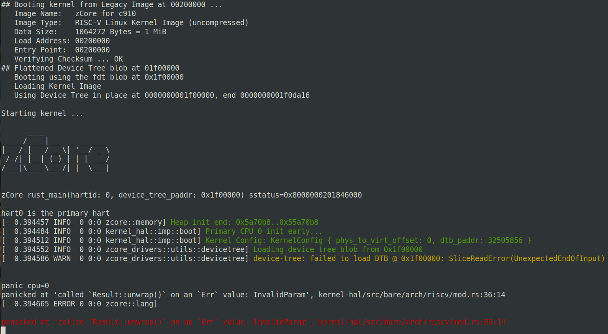
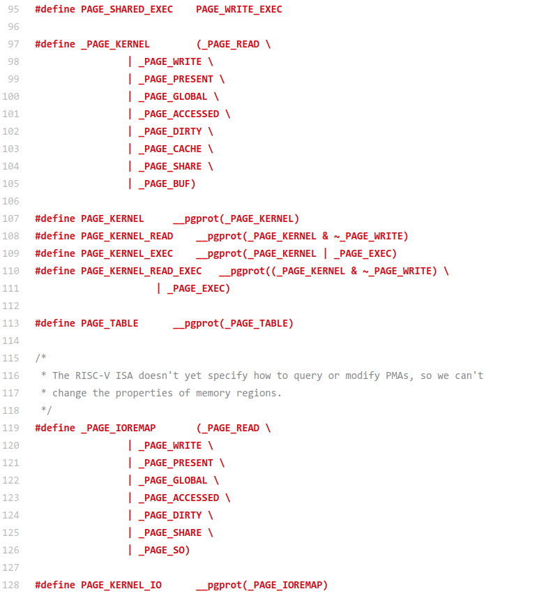
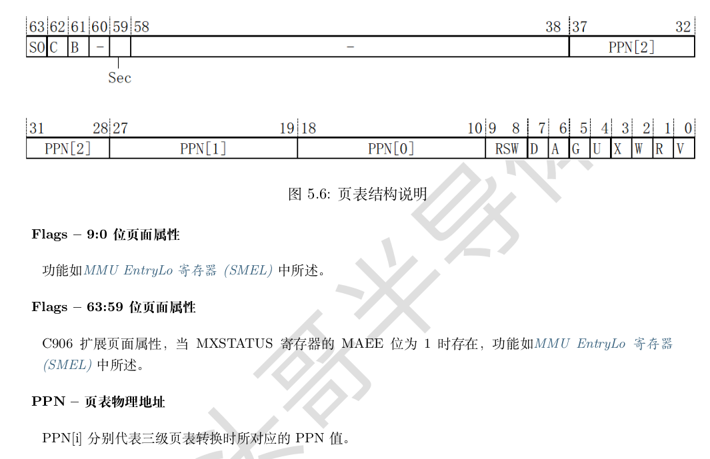
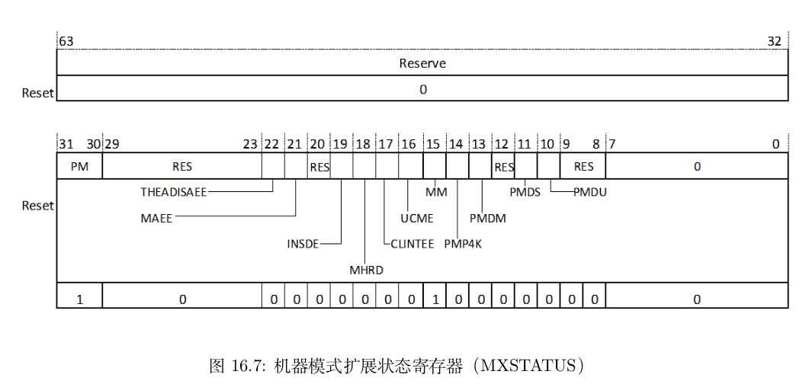
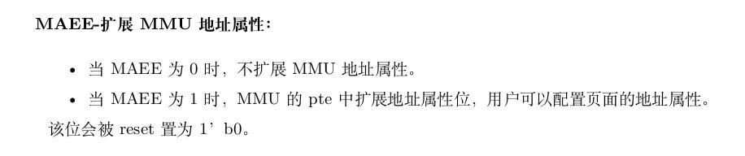
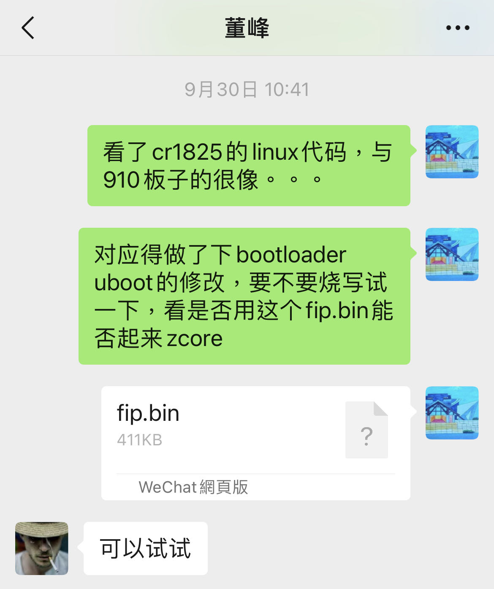
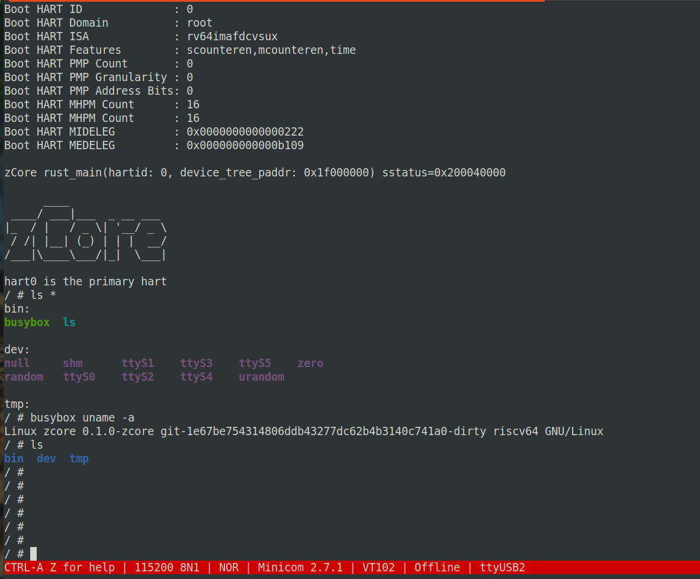

# zCore on riscv64

## T-HEAD C910 Light val board 操作说明
### 编译zCore内核镜像
编译zCore内核:
```
cd zCore/zCore
make build LINUX=1 MODE=release ARCH=riscv64 PLATFORM=c910light
```

制作u-boot系统镜像:
```
mkimage -A riscv -O linux -C none -T kernel -a 0x200000 -e 0x200000 -n "zCore for c910" -d ../target/riscv64/release/zcore.bin uImageC910
```

### 编译opensbi镜像
```
git clone https://github.com/elliott10/opensbi.git -b thead_light-c910

cd opensbi

make PLATFORM=generic CROSS_COMPILE=/path/to/toolchain/bin/riscv64-unknown-linux-gnu-
# 生成所需的fw_dynamic.bin
```
注：原编译工具链基于官方仓库https://gitee.com/thead-yocto/xuantie-yocto.git 编译生成出来的。理论上可以使用其他工具链替代之

### 基于u-boot运行

在搭建好tftp服务的服务器目录中，放入编译好的opensbi镜像`fw_dynamic.bin`和系统镜像`uImageC910`。<br>
进入配置好网络的C910 Light板子的u-boot命令行上，运行：
```
ext4load mmc 0:2 $aon_ram_addr light_aon_fpga.bin; ext4load mmc 0:2 $dtb_addr ${fdt_file};

tftp $opensbi_addr fw_dynamic.bin;
tftp $kernel_addr uImageC910;

bootslave; run finduuid; run set_bootargs; bootm $kernel_addr - $dtb_addr;

```

## T-HEAD C910 Light val board 移植说明
### 1. 系统初步分析并制作系统镜像


C910 Light开发板如上图，在取得C910 Light开发板后，先按照官方的用户手册了解基本的硬件组件，以及电源和串口等接口的接线。<br>
用户手册：https://gitee.com/thead-yocto/documents/blob/master/en/user_guide/T-Head%20Yeying1520%20Yocto%20User%20Guide.pdf <br>

电源接上，以及串口连接到host机后，可以看到有四个串口`/dev/ttyUSBX`，调试用串口是，host机连上该串口，并在启动u-boot时按任意键可进入命令行模式<br>
u-boot命令行模式上，可以连接通有线网络，并通过tftp协议加载待启动的操作系统镜像。<br>

```
# minicom -b 115200 -D /dev/ttyUSB2

U-Boot 2020.01-ge0ddd4721a (Dec 14 2021 - 22:26:59 +0800)

CPU:   rv64imafdcvsu
Model: T-HEAD c910 light
DRAM:  1 GiB
C910 CPU FREQ: 1500MHz
AHB2_CPUSYS_HCLK FREQ: 250MHz
AHB3_CPUSYS_PCLK FREQ: 125MHz
PERISYS_AHB_HCLK FREQ: 250MHz
PERISYS_APB_PCLK FREQ: 62MHz
GMAC PLL POSTDIV FREQ: 1000MHZ
DPU0 PLL POSTDIV FREQ: 1188MHZ
DPU1 PLL POSTDIV FREQ: 1188MHZ
MMC:   sdhci@ffe7080000: 0, sd@ffe7090000: 1
Loading Environment from MMC... OK
In:    serial@ffe7014000
Out:   serial@ffe7014000
Err:   serial@ffe7014000
Net:   eth0: ethernet@ffe7070000
Hit any key to stop autoboot:  0 
C910 Light# 

# setenv ipaddr <IP>
# setenv serverip <Server IP>

```

在这里一开始尝试fu740板子的zCore系统镜像制作以及tftp启动模式, 在u-boot命令行中配置开发板IP地址和服务器IP地址，通过tftp协议加载系统镜像，最后通过bootm运行镜像; <br>

其他正常，但这样在引导zCore系统镜像时会出现报错，显示无法识别该系统镜像.
```
Filename 'uImageC910'.
Load address: 0x200000
Loading: #################################################################
         #############################################
         5.1 MiB/s
done
Bytes transferred = 1609651 (188fb3 hex)
Wrong Image Format for bootm command
ERROR: can't get kernel image!
```
这个问题分析后，发现由于u-boot的版本不同，导致对系统镜像格式的识别不一致。<br>
在fu740板子上的zCore系统镜像是基于`.its`脚本的新`FIT image`;<br>
而C910 Light的板子上的u-boot则只支持`old legacy image`，需要这样制作：

```
mkimage -A riscv -O linux -C none -T kernel -a 0x200000 -e 0x200000 -n "zCore for c910" -d ../target/riscv64/release/zcore.bin uImageC910
```
### 2. zCore系统引导构建

根据板子已有的Linux系统镜像，可获知加载地址是`Load Address: 0x200000`, 执行入口地址是`Entry Point: 0x200000`.

由`0x200000`入口地址，修改zCore的linker.ld链接脚本文件的`BASE_ADDRESS`变量为相应的值，编译出zCore系统镜像在u-boot中，使用`tftp`命令网络加载镜像，`bootm`命令尝试引导镜像，发现在跳转内核后无任何反应。

这里分析可能有两种可能，第一可能zCore默认串口输出调用的opensbi print不正确，第二则可能在开始构建虚拟内存并跳转时出错。于是这里先让zCore引导启动时用物理内存的方式，把`zCore/src/platform/riscv/`目录中的引导有关的偏移地址变量暂修改成以`0x200000`为入口地址的相应的值即可，便没有了问题二，剩下了问题一关于opensbi的输出问题。

为了验证opensbi的输出是否正常，先尝试最精简的zCore镜像，在启动到rust代码的最早阶段，调用opensbi的`SBI_CONSOLE_PUTCHAR`输出功能。问题依旧无任何反应，这里陷入了问题僵局；

C910 Light开发板是一块四方形大板，配置接口很丰富，包括了调试CPU的JTAG口。根据平头哥的官方调试文档连接部署好调试环境 https://occ.t-head.cn/document?temp=linux&slug=t-head-debug-server-user-manual


通过gdb连接JTAG DEBUG Server后，便可以单步调试C910 CPU的指令执行了，不过偶尔也会有无法下断点的问题，需要先把zCore系统镜像加载到内存之后，再下函数断点。

在JTAG的单步调试过程中，发现在执行指令`ecall SBI_CONSOLE_PUTCHAR`之后，没有任何反应，理论上应该会有字符从串口输出。这里考虑没有有效的opensbi，要么串口驱动有问题。

解决print问题，解决串口输出比较直接，于是参照u-boot的串口代码，把串口输出的基本功能使能，代码如下：

```
// T-HEAD C910 light
pub fn uart_put(c: u8) {
    let ptr = BADDR as *mut u32;
    unsafe {
        //LSR bit:THRE
        while ptr.add(5).read_volatile() & (1 << 5) == 0 {}

        //此时transmitter empty, THR有效位是8
        ptr.add(0).write_volatile(c as u32);
    }
}
pub fn uart_get() -> Option<u8> {
    let ptr = BADDR as *mut u32;
    unsafe {
        //查看LSR的DR位为1则有数据
        if ptr.add(5).read_volatile() & 0b1 == 0 {
            None
        } else {
            Some((ptr.add(0).read_volatile() & 0xff) as u8)
        }
    }
}
```

于是zCore便可以运行输出了。

这里出现device tree解析DTB失败的问题，经研究尝试，发现是由于DTB加载到内存的空间，被zCore内核覆盖了，把DTB地址往高地址再移一段偏移便可以正常解析到DTB。



后面与平头哥的技术支持人员沟通，获得了C910 light板子的文档和代码，据此获知更多有效信息，可以自定义编译u-boot、Linux内核、以及文件系统等板子必要组件；

通过结合分析C910 light板子的文档和源代码，理清楚了C910 light板子的启动链:

```
U-Boot 运行于M态
	|
	V
OpenSBI 由U-Boot来加载，会从M态跳转至S态
	|
	V
Linux 由U-Boot来加载，并运行于S态
```

所有，若直接使用U-Boot单独加载一个zCore Kernel，是没有OpenSBI可print的，效果便是无任何输出，这里定位了问题便着手修复。

试验使用u-boot单独运行opensbi，发现并没有常见的“OPENSBI”大LOGO输出，于是尝试修复opensbi的串口，串口驱动缺少了对C910 light板子型号`snps,dw-apb-uart`的解析，于是走的通用串口型号`ns16550`，打上patch：https://github.com/elliott10/opensbi/commit/404951dd5b047873fa023545eafeb1fa2a9c5838

编译运行，OpenSBI的输出work！

### 3. zCore虚拟内存页表问题

zCore继续往下运行，便会遇到新的问题，停在切换页表`switch table`之后。

这是个很奇怪的问题，正常流程，这里会映射好zCore kernel的所有sections以及其他的内存地址空间，到一个新创建的页表中，映射的参数和过程都是复用的其他板子类型如qemu或D1等的。理论上这里没理由出现BUG，停在的地点如下：

```
[ 48.117274 INFO  0 0:0 kernel_hal::imp::arch::vm] initialized kernel page table @ 0x5c18000
[ 48.128044 DEBUG 0 0:0 kernel_hal::imp::arch::vm] cpu 0 switch table 2ec000 -> 5c18000
```

这个奇怪的问题再次上JTAG调试器，跟踪CPU运行到这里后单步指令的行为。

在`switch table`切换页表前下断点，单步跟踪，发现在`csrw satp`之后，程序便跑飞了，触发异常。于是怀疑satp使用的页表有问题。

Linux代码是zCore开发中非常好的参照，这里开始对照Linux的切换页表写satp的过程，找到一些参考：



Linux源码中的riscv架构下，在构建虚拟内存页表项时，

为内核镜像内存地址空间`PAGE_KERNEL`添加相比普通页表的额外的flags属性：`CACHE`,`SHARE`,`BUF`；

为设备地址空间`PAGE_IOREMAP`添加额外的属性：`SHARE`,`SO`;

这些页表项的额外的flags属性位，可以通过查询C910芯片手册获知其定义信息，C910额外页面属性位于`63:59`位，包括了`SO`, `CACHE`, `BUF`, `SHARE`, `SEC`

更加其他CPU芯片手册，可指导这些平头哥CPU的拓展属性，不单在C910中存在，在C906 CPU中通用存在。



zCore中先尝试把内核的`CACHE`,`SHARE`,`BUF`这些位在构建内核页表时置位上，启动发现问题依旧，依然停在切换页表`switch table`之后，原因不详？？？

既然基于RISCV标准进行自定义拓展的位，理论上应该是可以关闭的吧，于是继续在芯片手册中查找，果然在拓展状态寄存器`MXSTATUS`中找到了相应的设置位`MAEE`



C910 CPU的MAEE拓展位可以设置是否打开拓展的MMU地址属性，即是否使能`SO`, `CACHE`, `BUF`, `SHARE`, `SEC`。

设置`MAEE = 0`时, 不拓展MMU地址属性`SO`, `CACHE`, `BUF`, `SHARE`, `SEC`；

设置`MAEE = 1`时, 使能拓展MMU中PTE的地址属性`SO`, `CACHE`, `BUF`, `SHARE`, `SEC`，并可以在页表项PTE中设置对应位；



于是直接关闭虚拟内存的页表项拓展属性，设置`MAEE = 0`，果然之前停在页表切换处`switch table`的问题通过了。zCore可以继续往下执行开始解析设备树的各node节点，后面接着会遇到设备地址过高，导致在处理解析到的node节点地址时出错...

### 4. 页表项PTE的拓展属性设置MAEE于CR1825板子的尝试

之前一次与DF交流CR1825目前遇到的BUG情况时，一开始有提议说可能内核的`.BSS`段可能未清除干净。

因为在去年刚把增加了riscv支持的zCore移植到D1时，也出现过，spin原子指令死锁的问题，这个问题当时请教的JYK童鞋后，给思路原来`.bss`段没clear干净，导致未初始化时的原子变量存在了随机值，持续死锁。


不过，这个清除`.bss`段应该是随后就加上了。虽然后来引导启动部分有重构过，DF也确认确有执行`.bss`段清除。

我在调试C910的期间，在芯片手册中了解页表属性及其相关的其他寄存器位的同时，也对比C906手册，发现基本两CPU在属性设置方面没有大的区别。

在修复好C910 light板子的停在页表切换处`switch table`的问题后，与DF交流并取得cr1825的opensbi, u-boot, Linux等的源代码，主要对比与C910 light板子的启动代码的区别。

发现带C906 CPU的cr1825与C910 CPU的light板子的启动代码很相似，包括虚拟内存的构建过程，同样也对内核虚拟内存的页表项配置了拓展位`cache`, `share`, `buf`，而原生zCore从未对这些位进行配置。

于是猜想也许页表项PTE的拓展位设置问题，与当前cr1825遇到的原子锁问题有很大的关联，原子操作即是需要对虚拟内存中的某个值进行判断改写。

为了验证该猜想，制作了一个cr1825的启动引导镜像`fip.bin`, 方式是直接关闭虚拟内存的页表项拓展属性，设置`MAEE = 0`，代码修改如：https://github.com/elliott10/opensbi/commit/404951dd5b047873fa023545eafeb1fa2a9c5838

请DF帮忙远程验证，幸运地原子锁的问题也通过了，的确与平头哥的拓展页表项有关！




之后在群里与YDR等人继续交流关于平头哥拓展位的原理问题，并获得平头哥技术人员的确认: "PTE中cacheable代表该page可以被906 cache缓存，如果为0则不会进入缓存。PTE中bufferable位控制总线传输时的bufferable信号是否拉起，在行为上cpu并不关心"；“amo指令需要cache支持，也就是不能在非cache的区域使用amo指令”。

cr1825锁卡住的问题通了后，后面进展较顺利了。

在打开`maee`的情况下，这里可能需要注意内核镜像和设备地址空间所设置的`PTE`额外属性值不同。

根据Linux源码，在构建虚拟内存页表项时，

为内核镜像内存地址空间`PAGE_KERNEL`添加相比普通页表的额外的flags属性：`CACHE`,`SHARE`,`BUF`；

为设备地址空间`PAGE_IOREMAP`添加额外的属性：`SHARE`,`SO`;

### 5. 设备地址过高的问题

前面讲到zCore构建好虚拟内存之后，解析设备树的各node节点时，后面接着会遇到设备地址过高的问题，导致在处理解析到的node节点地址时出错。

例如从设备树中，取得的串口基地址是`0xffe7014000`，该地址比一般的设备地址大，例如相比Qemu的串口基地址`0x10000000`。C910 light板子的多种设备基地址都类似的这么大。在物理地址空间中这些大的设备地址不会出问题，但在zCore构建好内核虚拟内存后，当统一加上一个`offset`如`0xffffffe000200000`，便溢出了SV39模式的虚拟内存地址空间。

对于地址溢出时，对该问题做一个简单的判断处理，把溢出的保留位重新置为`1`即可：

```
paddr | (0x1ffffff << 39)
```

### 5. C910 light板子运行

zCore顺利运行进busybox shell：

