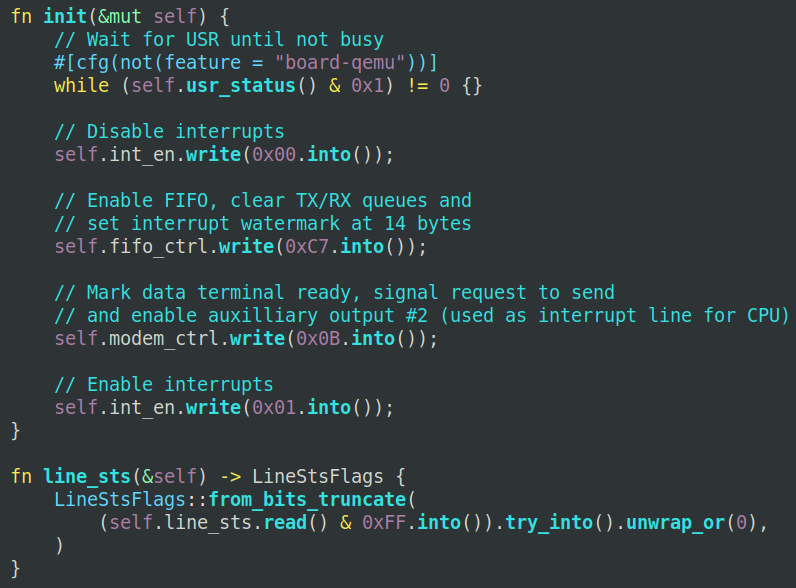
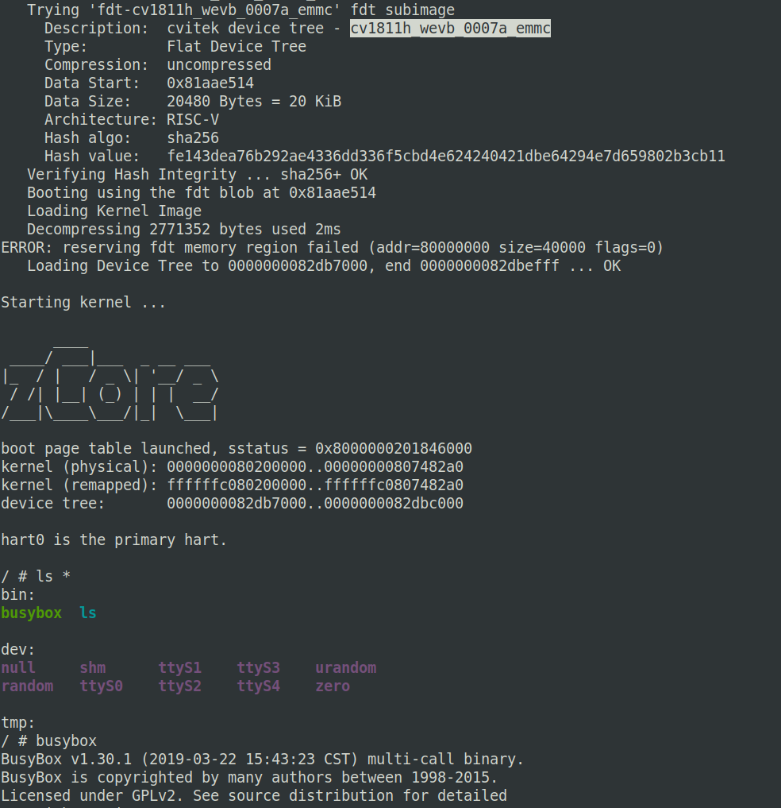

# 华山派`CV1811H`板子适配于zCore

## 一、适配前的开发板信息整理

启动华山派`CV1811H`板子的远程系统，并连接到串口信息输出。

引导启动的早期阶段可以看到字符输出`OpenSBI v0.9`;

进入U-Boot阶段，可以看到板级名称`mars`,  串口波特率`115200`等信息；

物理内存地址`memory@80000000`, OS可用内存大小是`0x7f40000`, 128M左右；

U-Boot阶段还支持了以太网`ethernet@4070000`；

加载Linux过程则是把U-Boot `FIT` 格式的Linux镜像文件，加载进内存的指定地址中，启动命令`bootm ${uImage_addr}#config-cv1811h_wevb_0007a_emmc`引导进入Linux系统；

从原厂U-Boot加载Linux Kernel可以获知，内核镜像文件的加载地址`uImage_addr=0x81800000`，设备树配置为`#config-cv1811h_wevb_0007a_emmc`；

进入到原厂Linux系统中，获取到`fdt`设备树。设备树用于OS的硬件外设参数解析及初始化；

### 梳理清楚了华山派`CV1811H`板子的启动链:

```
OpenSBI 运行于M态
	|
	V
U-Boot 由OpenSBI引导，运行于S态
	|
	V
Linux 由U-Boot来加载，并运行于S态
```

## 二、编译制作可引导的系统镜像

### 编译zCore内核镜像

```shell
make image ARCH=riscv64 # 快速制作文件系统镜像
cd zCore
make build LINUX=1 ARCH=riscv64 PLATFORM=cv1811
```

### 基于U-Boot启动系统镜像

由于U-Boot阶段已经支持了以太网，可以使用tftp网络协议来加载系统镜像文件，方便开发调试；

首先搭建一台tftp服务器, 若使用Ubuntu系统，可以安装tftp服务作为系统镜像服务器：

`sudo apt install tftpd-hpa`

默认的服务目录在`/srv/tftp`

编译生成制作的系统镜像文件`zcore-cv1811.itb`放入该tftp服务目录；

开发板CV1811开机，并进入U-Boot命令行：

```shell
# 配置开发板IP地址和服务器IP地址
setenv ipaddr 192.168.0.10 #设置获取到的IP地址
setenv serverip 192.168.0.66 #设置服务器地址
saveenv #保存变量设置

# 通过tftp协议网络加载系统镜像
tftp ${uImage_addr} zcore-cv1811.itb

# 引导内核运行
bootm ${uImage_addr}
```

### FIT系统镜像制作

自开发的OS内核，都可以使用同样的方式进行U-Boot加载引导，这里制作U-Boot FIT 格式的zCore系统镜像文件；

制作U-Boot FIT 格式的镜像需要用到`内核kernel`、`设备树fdt`、`配置文件.its`，也即最终生成的镜像会包含内核和设备树；

配置文件.its如下：

```json
        images {
                kernel-1 {
                        description = "cvitek kernel zCore for cr1825";
                        data = /incbin/("../../../zCore/zcore.bin");
                        type = "kernel";
                        arch = "riscv";
                        os = "linux";
                        compression = "none";
                        load = <0x0 0x80200000>;
                        entry = <0x0 0x80200000>;
                        hash-2 {
                                algo = "crc32";
                        };
                };
                /*FDT*/
                fdt-cv1811h_wevb_0007a_emmc {
                        description = "cvitek device tree - cv1811h_wevb_0007a_emmc";
                        data = /incbin/("./cv1811h-fdt.dtb");
                        type = "flat_dt";
                        arch = "riscv";
                        compression = "none";
                        hash-1 {
                                algo = "sha256";
                        };  
                };
        };
        /*CFG*/
        configurations {
                default = "config-cv1811h_wevb_0007a_emmc";
                config-cv1811h_wevb_0007a_emmc {
                        description = "boot cvitek system with board cv1811h_wevb_0007a_emmc";
                        kernel = "kernel-1";
                        fdt = "fdt-cv1811h_wevb_0007a_emmc";
                };
        };

```

配置文件中，在`kernel`的区域中填入编译生成的内核文件，`fdt`字段中放入设备树.dtb文件;

生成`zcore-cv1811.itb`镜像文件的命令如下：

`mkimage -f cv1811.its ./zcore-cv1811.itb`

## 三、自定义OS开发要点

### 执行入口地址


当U-Boot加载引导OS镜像时，开始会解析并引导自开发的OS的执行入口等地址

这是可以看到解析的执行入口`     Entry Point:  0x80200000`, 便是在上`.its`配置文件中定义的`entry = <0x0 0x80200000>`;

U-Boot的`.its`配置的执行入口地址非常重要，往往需要与内核的`.ld`链接脚本中定义的入口地址一致。

例如zCore这里链接的入口虚拟地址是`0xffffffc080200000`, 对应到这个`0x80200000`物理地址；当然在启动zCore时需要构建好内核页表，正确映射该虚拟地址与物理地址的对应关系；

正确核对内核的入口地址，是成功启动自开发OS的第一步！

### 字符串打印输出

启动的关键的第二步是打印输出。

为了验证自开发OS的输出是否正常，先尝试最精简的zCore镜像，在启动到Rust代码的最早阶段，调用 `OpenSBI`的串口输出功能；

最开始引导阶段可以先不着急去初始化串口设备的字符输出驱动，这个过程比较繁琐且地址寄存器操作容易出错；

由于大多数原厂的riscv64设备，一般会通过 `OpenSBI` 引导，`OpenSBI`具备串口字符输出的功能，在自开发操作系统中通过调用`ecall` `SBI_ECALL_CONSOLE_PUTCHAR`输出字符，可以通过循环输出单个`u8`字符的方式进行字符串输出；

调用`OpenSBI` 进行字符输入与输出的方式如下所示：

```rust
pub fn console_putchar(ch: usize){
    sbi_call(SBI_CONSOLE_PUTCHAR, ch, 0, 0); 
}

pub fn console_getchar() -> isize {
    return sbi_call(SBI_CONSOLE_GETCHAR, 0, 0, 0); 
}

fn sbi_call(which: usize, arg0: usize, arg1: usize, arg2: usize) -> isize{
    let ret: isize;
    unsafe{
        asm!("ecall",
             lateout("x10") ret,
             in("x10") arg0, in("x11") arg1, in("x12") arg2, in("x17") which
            );
    }
    ret
}
```

在引导自开发OS时，有字符串输出便极大地方便OS运行状态的打印与调试。

### 串口驱动初始化的问题

在使用华山派`CV1811H`开发板运行旧版的zCore时，引导进入zCore之后，会循环出现如下`Interrupt(9)`输出，而导致无法争取进入用户态的busybox shell交互界面。

```
[ 68.270562 DEBUG 0 0:0 zcore_loader::linux] go to user: tid = 1030 pc = 100e8
[ 68.280592 DEBUG 0 0:0 zcore_loader::linux] back from user: tid = 1030 pc = 100e8 trap reason = Interrupt(9)
[ 68.293422 DEBUG 0 0:0 zcore_loader::linux] go to user: tid = 1030 pc = 100e8
[ 68.303439 DEBUG 0 0:0 zcore_loader::linux] back from user: tid = 1030 pc = 100e8 trap reason = Interrupt(9)
[ 68.316259 DEBUG 0 0:0 zcore_loader::linux] go to user: tid = 1030 pc = 100e8
[ 68.326287 DEBUG 0 0:0 zcore_loader::linux] back from user: tid = 1030 pc = 100e8 trap reason = Interrupt(9)
[ 68.339107 DEBUG 0 0:0 zcore_loader::linux] go to user: tid = 1030 pc = 100e8
[ 68.349135 DEBUG 0 0:0 zcore_loader::linux] back from user: tid = 1030 pc = 100e8 trap reason = Interrupt(9)
```

对该问题进行追踪调查，根据错误提示表示系统循环触发9号中断，代表的外设中断；进一步调试外设初始化流程，发现是串口设备触发的循环外部中断；

为什么会出现这个问题呢？

原来在`Uart`串口设备驱动初始化`init()`函数引发的。在OS系统镜像引导阶段，其实已经可以通过OpenSBI进行字符输出，此时的`Uart`串口设备处于工作的发送字符或接收字符状态，而在自开发OS中，进行初始化函数`init()`里，会对`Uart`串口设备的配置寄存器进行设置。此时的`Uart`寄存器设置是在`busy`状态，从而触发了错误警示的串口中断。

解决方法也很简单，就是在自开发OS的串口设备驱动中，设置串口寄存器前，检查串口的状态，读串口的`UART Status Register`状态寄存器可获知`Uart`状态，等待该寄存器数值呈现非`busy`状态时再进行`Uart`串口寄存器初始化。如下：




### 虚拟内存

华山派`CV1811H`开发板使用了平头哥的C906的CPU。

根据Linux源码中的riscv架构相关代码部分，在构建虚拟内存页表项时，需要分别为`内核镜像内存地址空间`和`设备地址空间`进行额外的页表flags属性。具体如下：

-  为内核镜像内存地址空间`PAGE_KERNEL`添加相比普通页表的额外的flags属性位：`bit[62] CACHE`,`bit[61] BUF`，`bit[60] SHARE`；

-  为设备地址空间`PAGE_IOREMAP`添加额外的属性：`bit[63] SO`，`bit[60] SHARE`;

这些页表项的额外的flags属性位，可以通过查询C906芯片手册获知其定义信息，如下图，C906额外页面属性位于`63:59`位，包括了`SO`, `CACHE`, `BUF`, `SHARE`, `SEC`

根据其他CPU芯片手册，可知道这些平头哥CPU的拓展属性，不单在C906中存在，在C910 CPU中也同样存在。


这些是平头哥CPU自定义的页表的额外的flags属性位，通过查找芯片手册，可以在拓展状态寄存器`MXSTATUS`中找到了相应的设置位`MAEE`。C906 CPU的MAEE拓展位可以设置是否打开拓展的MMU地址属性，即是否使能拓展MMU中PTE的地址属性`SO`, `CACHE`, `BUF`, `SHARE`, `SEC`

默认在打开`maee`的状态时，可以在页表项PTE中设置对应位，这里需要注意内核镜像和设备地址空间所设置的`PTE`额外属性值不同。

## 四、华山派`CV1811H`板子运行zCore

zCore顺利运行进`busybox` shell




